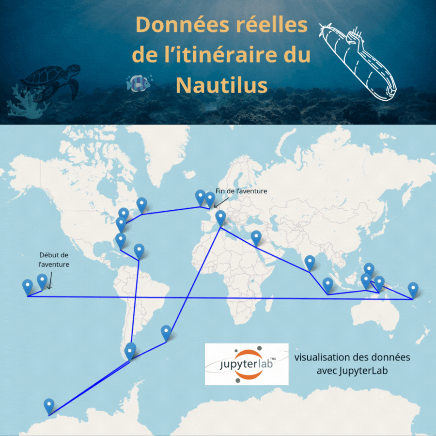

# Nautilus Project
 
 # 🚀 Nautilus Project – Data Science & Geospatial Analysis 🌊📊  

> *"Le voyage d’un explorateur ne s’arrête pas aux frontières visibles, mais s’étend aux données qui racontent une histoire."* – Émilie Clain  

## 🌟 À propos du projet  

Le **Nautilus Project** est une exploration analytique et data-scientifique inspirée de mon adoration pour la lecture et de mon esprit analytique. 📖💡  
Fascinée par les **itinéraires fictifs et leurs cohérences géographiques**, j’ai décidé d’analyser et de visualiser les **escales du Nautilus** dans *20 000 lieues sous les mers* de Jules Verne.  

📡 **Objectif** : Transformer ce voyage légendaire en **données exploitables** et en **visualisations interactives** grâce aux outils de Data Science.  

---

## 📌 Fonctionnalités  

🔹 **Structuration et nettoyage des données** (CSV, `pandas`)  
🔹 **Conversion des coordonnées en décimal** pour une exploitation optimale 🌍  
🔹 **Visualisation des itinéraires avec `matplotlib` et `seaborn`** 📊  
🔹 **Cartographie interactive avec `Folium`** 🗺️  

---

## 🛠️ Installation et utilisation  

### 1️⃣ **Installation des dépendances**  
Assurez-vous d’avoir Python installé, puis exécutez :  

```bash
pip install pandas folium matplotlib seaborn

/nautilus_project
│── README.md      # Documentation
│── data/          # Données brutes & transformées
│── notebooks/     # Notebooks Jupyter avec les analyses
│── scripts/       # Scripts Python pour la transformation des données
│── results/       # Images & exports des visualisations

---
## ⚖️ Licence et Copyright  

© 2024 **Émilie Clain** - Tous droits réservés.  

📜 Ce projet est protégé. Toute reproduction ou utilisation sans autorisation est interdite.  
🔗 Si vous souhaitez en savoir plus ou collaborer, contactez-moi via [portfolio](https://mimiecmoua.github.io/portfolio/).

## carte intéractive


